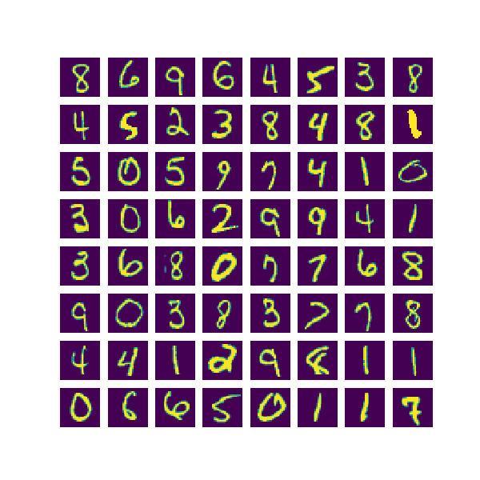
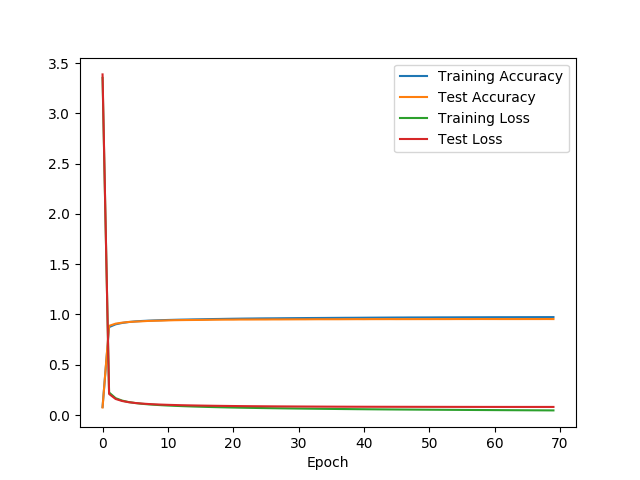

# Numpy Mnist Classifier

This project was done for learning purpose.
The goal was to implement a deep neural network to do supervised learning.
The MNIST data set was used due to its small size, making the learning process fast enough on a personal laptop.

To try the project you first need to install the dependencies, note that `python3` is required.

```bash
pip install -r requirements/basic.txt
```

## Usage

It only takes a small amount of code to test some models :

```python
    from classifier import nn, training
    from data import mnist

    # The MNIST data set will be automatically downloaded and cached.
    training_data, validation_data, test_data = mnist.load()

    # Create a Neural Network with one hidden layer.
    model = nn.NeuralNetwork([784, 30, 10], learning_rate=0.02, batch_size=50)

    # Train the model with early stopping regularization.
    model_training = training.EarlyStoppingRegularization(model,
                                                          training_data,
                                                          validation_data,
                                                          test_data,
                                                          max_steps_without_progression=2)
    model_training.train()

    # It is possible to save the result which serializes the model and create a report.
    result.save('models/mnist-example')

    # It is possible to load the trained model for futur uses.
    model_trained = nn.load('models/mnist-example/model.pkl)
```

## Report Example

## Model

- Layers : [784, 30, 10]
- Activation : sigmoid
- Learning Rate : 0.02
- Batch Size : 50

## Training

- Method : early stopping regularization
- Epochs : 69

## Data

Size :

- Training : 50000
- Test : 10000
- Validation : 10000

### Sample



## Accuracy and Loss

|   | Training | Test |
|---|---|---|
| Accuracy | 97.392% | 95.430%  |
| Loss | 0.046 | 0.081 |


